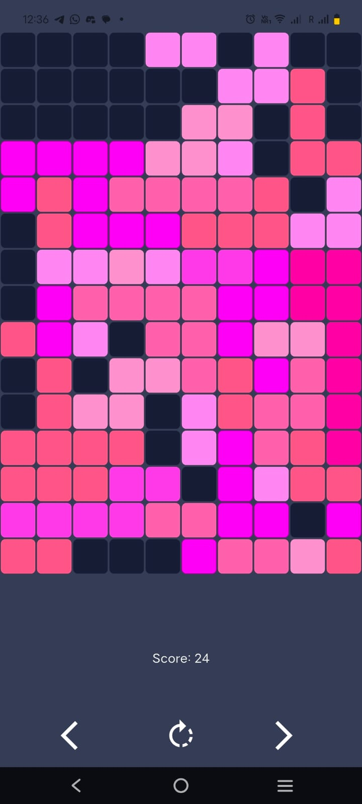
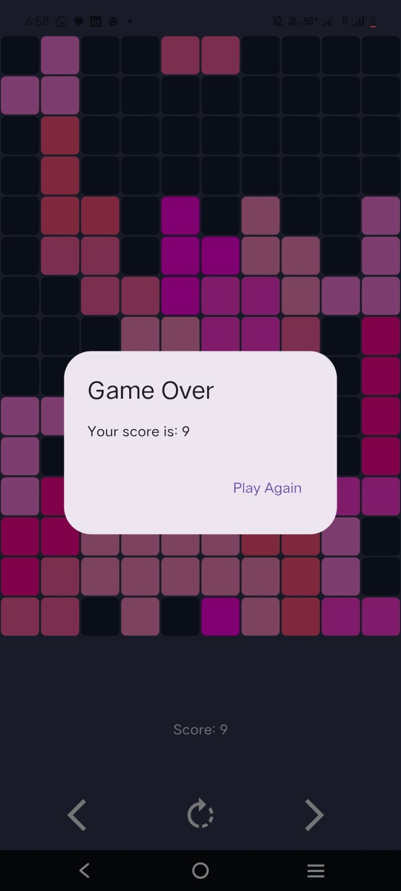
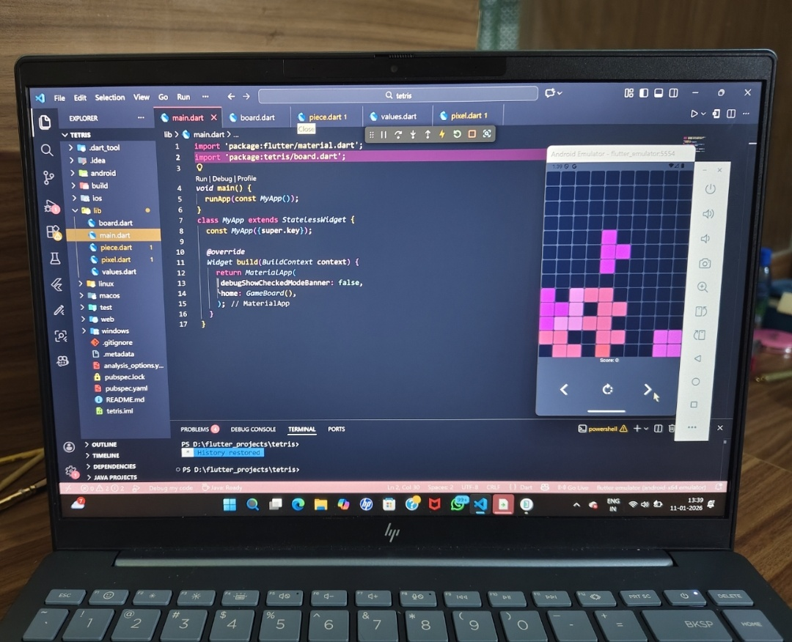

# ◼ Flutter Tetris

> A precision-built Tetris clone for Android — clean mechanics, bold design, zero compromise.


---

## Screenshots

<p align="center">
  
  &nbsp;&nbsp;&nbsp;
  
  &nbsp;&nbsp;&nbsp;
  
</p>

<p align="center">
  <em>Gameplay &nbsp;|&nbsp; Game Over flow &nbsp;|&nbsp; Built in VS Code with Flutter</em>
</p>

---

## About

This project started with a simple question: *Can I build a game that actually feels right to play?*

So I chose Tetris — not to reinvent it, but to respect it. I built, designed, and shipped this Flutter-based Tetris game from the ground up. The real challenge wasn't visuals or novelty. It was engineering gameplay that's precise, predictable, and stable. No gimmicks. Just mechanics that work the way they should.

---

## Features

- **Real-time piece movement** — accurate rotation and lateral control with frame-precise rendering
- **Grid-based collision logic** — enforces valid moves every frame, no edge case surprises
- **Automatic line clears** — row detection, clean clears, and live score updates
- **Game over flow** — structured end state with a clean retry loop
- **Smooth and consistent gameplay** — continuous state updates with no glitches

---

## Tech Stack

| Layer | Technology |
|-------|-----------|
| UI Framework | Flutter |
| Language | Dart |
| Platform | Android |
| Design | Figma |

### Project structure

```
lib/
├── main.dart       # App entry point
├── board.dart      # Game board + state management
├── piece.dart      # Tetromino logic
├── pixel.dart      # Individual cell rendering
└── values.dart     # Constants and theme values
```

---

## Getting Started

### Prerequisites

- Flutter SDK (latest stable)
- Android Studio or VS Code with Flutter extension
- A connected Android device or emulator

### Run locally

```bash
# Clone the repo
git clone https://github.com/yourusername/flutter-tetris.git
cd flutter-tetris

# Install dependencies
flutter pub get

# Run on a connected device or emulator
flutter run
```

### Build a signed APK

```bash
flutter build apk --release
```

---

## Design

The app icon was created from scratch in Figma. The UI follows a tech-inspired pink theme — minimal, clean, and a little bold. The color palette spans hot pink to soft lavender on a deep navy grid, creating a look that's cohesive and distinctly personal. Clarity first, personality second.

---

## What I Learned

From idea to signed APK, this project walked me through the full app development lifecycle — game logic, state management, and what it actually means to ship something *complete*, not just "working."

Everything runs on continuous state updates with frame-accurate rendering in Flutter, which means the gameplay stays smooth and consistent.

> Sometimes the best way to learn isn't by chasing complexity. It's by building something simple and getting every detail right.

---

## License

This project is open source and available under the [MIT License](LICENSE).

---

#FlutterDev &nbsp; #AndroidDevelopment &nbsp; #GameDevelopment &nbsp; #UIUX &nbsp; #Figma &nbsp; #LearningByBuilding &nbsp; #StudentDeveloper
